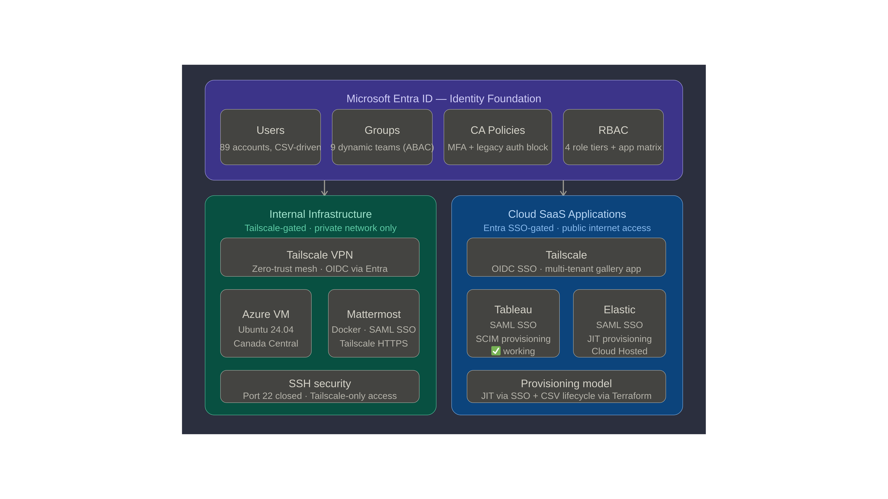

# TinyCo Entra ID — Security & Privilege Model

**Document Type:** Admin Documentation  
**Author:** Will Chang, Zero Trust AI Engineer  
**Audience:** IT Administrator  
**Last Updated:** September 2026  
**Repository:** https://github.com/willshchang/WSHC-ZTAI-Lab  

---

## Overview

This document describes the security architecture and privilege model 
implemented for TinyCo's Microsoft Entra ID (formerly Azure Active 
Directory) tenant. Every decision follows the principle of least 
privilege — users and teams receive only the access they need to 
perform their role, nothing more.

For the full architectural rationale and design decisions behind 
this model, see [ARCHITECTURE.md](../ARCHITECTURE.md).

 
[Showing Zero Trust two-layer model — Tailscale gates internal, Entra SSO gates SaaS]

---

## Core Security Principles

### Least Privilege
Every team receives the minimum access required to perform their 
function. No team has more access than their role requires. In the 
current lab environment, all teams are assigned access to the four 
core applications as specified in the project brief. In production, 
per-app RBAC (Role-Based Access Control) files would implement 
granular role differentiation — see 
[ARCHITECTURE.md — Per-App RBAC Design](../ARCHITECTURE.md#per-app-rbac-design).

### Group-Based Access
Permissions are assigned to groups, never to individual users:
- Adding a user to a group instantly grants correct access
- Removing a user from a group instantly revokes all associated access
- Access is auditable at the group level — one view shows who has what

### Identity as the Perimeter
TinyCo is a remote-first company. There is no corporate network 
perimeter — every resource is accessed over the internet. Identity 
verification is the primary security control. Every sign-in is 
evaluated by Conditional Access (CA) before access is granted 
(CA needs Entra ID P1; on the current Free tenant the existing 
policies are frozen, see [Conditional Access Policies](#conditional-access-policies)).

### Zero Trust — Two Layers
TinyCo implements a two-layer Zero Trust model:

**Layer 1 — Identity (Entra ID SSO)**
Cloud SaaS applications (Tableau, Elastic) are protected by Entra 
ID SSO via SAML (Security Assertion Markup Language) or OIDC 
(OpenID Connect). MFA (Multi-Factor Authentication) is required 
on every sign-in by Conditional Access policy.

**Layer 2 — Network (Tailscale)**
Internal resources (Azure VM, Mattermost) are unreachable from the 
public internet. SSH port 22 is closed in the Azure Network Security 
Group (NSG). Access requires an active Tailscale connection. Even an 
attacker with valid Entra credentials cannot reach internal 
resources without being on the Tailscale network.

> **Lab status:** the tailnet admin currently signs in to Tailscale 
> with a personal identity provider, not Entra ID, so Entra CA and 
> MFA do not gate the tailnet today. Moving the tailnet to Entra ID 
> as its identity provider, and using SCIM-synced Entra groups in 
> the Tailscale ACL, is a planned step.


---

## RBAC Model

### Entra ID Directory Roles

| Team | Entra Role | What They Can Do |
|---|---|---|
| **ITOps** | Global Administrator | Full control over the entire Entra tenant — manage users, groups, apps, policies, and all settings |
| **Security** | Security Reader | Read-only access to all security settings, audit logs, and sign-in reports across the tenant |
| All others | No directory role | Standard users — can access assigned applications only |

Role template IDs (from Microsoft's 
[built-in roles reference](https://learn.microsoft.com/en-us/entra/identity/role-based-access-control/permissions-reference)), 
set in `entra_role_map` in `terraform.tfvars`:

| Role | Template ID |
|---|---|
| Global Administrator | `62e90394-69f5-4237-9190-012177145e10` |
| Security Reader | `5d6b6bb7-de71-4623-b4af-96380a352509` |

> `729827e3-9c14-49f7-bb1b-9608f156bbb8` is **Helpdesk 
> Administrator**, not Security Reader. An earlier version of the 
> setup guide used it for the Security team by mistake.

### Azure Subscription Roles

| Team | Azure Role | What They Can Do |
|---|---|---|
| **SRE** | Contributor | Create and manage all Azure cloud resources — VMs, networking, storage. Cannot manage identity |
| **Backend** | Reader | View Azure cloud resources and infrastructure. Cannot make changes |
| All others | No subscription role | No Azure infrastructure access |

### Why These Specific Roles?

**ITOps → Global Administrator**
ITOps is responsible for the entire tenant — provisioning users, 
managing applications, configuring security policies, and responding 
to incidents. Global Administrator is the only role that provides 
the full access scope required.

**SRE → Contributor**
SRE manages TinyCo's cloud infrastructure. Contributor grants full 
resource management without the ability to modify identity or security 
settings — this separation ensures cloud operations and identity 
administration remain distinct functions.

**Security → Security Reader**
The Security team's role is to audit, not administer. Security Reader 
provides complete read-only visibility across all security settings, 
CA policies, sign-in logs, and audit trails — everything needed to 
investigate incidents without the ability to accidentally modify 
configurations.

**Backend → Reader**
Backend engineers need visibility into the Azure infrastructure their 
applications run on. Reader provides this without granting any ability 
to modify resources.

**Frontend, Design, Product, People Ops, Legal → No Azure Role**
These teams have no operational need to access Azure infrastructure 
or Entra administration. Standard user access to their assigned 
applications is sufficient.

---

## Application Access Model

Application access is controlled by group assignment in Entra ID. 
Only users in an assigned group can authenticate to an application 
via SSO (Single Sign-On): every Terraform-managed SAML app sets 
`app_role_assignment_required = true`, so Entra refuses a token to 
any user or guest without an assignment.

> **Licensing:** assigning a *group* to an app needs Entra ID P1. On 
> the current Free tenant only direct user assignments are supported, 
> so the team-group assignments in `rbac.tf` are not licensed. See 
> the licensing matrix in [01-identity/README.md](../../README.md#licensing-what-needs-entra-id-p1). 
> The Tailscale app is a gallery service principal that Terraform 
> only looks up, so its "assignment required" setting is not managed 
> in code.

### Current Lab Assignment

| Application | Access | Protocol | Provisioning |
|---|---|---|---|
| **Tailscale** | All 9 teams | OIDC | JIT via SSO |
| **Mattermost** | All 9 teams | SAML | JIT via SSO |
| **Tableau** | All 9 teams | SAML | SCIM + JIT |
| **Elastic** | All 9 teams | SAML | JIT via SSO |

> **Lab note:** All teams are assigned to all four core applications 
> per the project brief requirement. In production, a least-privilege 
> role matrix would scope access by team function. See 
> [ARCHITECTURE.md](../ARCHITECTURE.md#per-app-rbac-design) for the 
> production design.

### Stub Applications (Registered, Not Configured)

The following applications are registered in Entra as stubs — 
their existence is tracked in the codebase but SSO and provisioning 
are not yet configured:

| Application | Teams |
|---|---|
| Asana | All teams |
| Figma | Design, Frontend, Product, ITOps |
| Zoom | All teams |
| Adobe | Design, Product, People Ops, Legal |
| PagerDuty | ITOps, SRE, Security, Backend |
| Icinga | ITOps, SRE, Security, Backend |
| HackerOne | Security |
| ADP | People Ops, Legal, ITOps |
| CultureAmp | People Ops, ITOps |
| SurveyMonkey | Product |

No group is assigned to the stubs yet and they require an app role 
assignment, so nobody can sign in to them until access is granted 
on purpose.

---

## Conditional Access Policies

Two CA policies were deployed via Terraform during the E5 trial and 
are version-controlled.

> **Licensing status:** Conditional Access needs Entra ID P1. The 
> tenant is now on Entra ID Free. Microsoft does not disable or 
> delete policies when the license expires, but they can only be 
> viewed or deleted, not updated 
> ([source](https://learn.microsoft.com/en-us/entra/identity/conditional-access/overview#license-requirements)). 
> Any Terraform change to `conditional-access.tf` will fail on apply 
> until P1 is back.

### Policy 1 — Require MFA for All Users

| Setting | Value |
|---|---|
| Scope | All users, all applications, all devices |
| Action | Require MFA |
| Exclusion | Security-Exclusion-Emergency group |
| State | Enabled |

**Rationale:** MFA blocks 99.9% of account compromise attacks 
according to Microsoft's own data. At a privacy-focused company 
like TinyCo, protecting user identity is non-negotiable.

### Policy 2 — Block Legacy Authentication

| Setting | Value |
|---|---|
| Scope | All users, legacy protocol clients |
| Protocols blocked | Exchange ActiveSync, other legacy clients |
| Action | Block access entirely |
| Exclusion | Security-Exclusion-Emergency group |
| State | Enabled |

**Rationale:** Legacy authentication protocols (IMAP, SMTP, POP3, 
older Office clients) do not support MFA. Attackers actively exploit 
these protocols to bypass modern security controls. Blocking legacy 
authentication closes this attack vector entirely — recommended by 
Microsoft, CIS Benchmarks, and NIST.

### Why Security Defaults Were Disabled

Microsoft enables Security Defaults on all new tenants as a basic 
free security layer. Security Defaults and custom CA policies cannot 
coexist in the same tenant. While TinyCo had the E5 licence with 
full CA capabilities, Security Defaults were disabled in favour of 
more granular, auditable custom policies. On a tenant without P1, 
Security Defaults is the baseline to turn back on.

---

## Break-Glass Account

**Account:** `breakglass.admin@<tenant>.onmicrosoft.com`  
**Role:** Global Administrator, assigned directly to the user, permanent and active  
**Purpose:** Emergency access when all other admin accounts are unavailable  
**Password:** Its own `breakglass_password` (16+ characters, never the shared employee password), stored outside the repo  
**Guidance followed:** [Manage emergency access admin accounts](https://learn.microsoft.com/en-us/entra/identity/role-based-access-control/security-emergency-access)

NOTE: Tailscale admin console access must be granted manually after the break-glass account's first login by an existing admin or owner.
Go to login.tailscale.com/admin/users and change the account role to Admin.

### What is a Break-Glass Account?

A break-glass account is a dedicated emergency access account that 
exists outside normal security controls. It is a standard enterprise 
practice recommended by Microsoft for every Entra tenant. Without it, 
a misconfigured CA policy could lock all administrators out of the 
tenant permanently.

### What Terraform Does (`users.tf`)

| Control | Implementation | Why |
|---|---|---|
| Own password | `password = var.breakglass_password`, validated to 16+ characters and different from `admin_password` | The shared employee initial password is known to everyone onboarded with it |
| Not in any team group | No `department` attribute | The dynamic team groups match on `department`. With `ITOps` it was in the ITOps group and got every SSO app plus the ITOps Azure roles |
| Global Administrator, permanent and active | `azuread_directory_role_assignment.breakglass_global_admin` (template `62e90394-69f5-4237-9190-012177145e10`) directly on the user | Microsoft: assign Global Administrator to emergency accounts as permanent active, not PIM-eligible, and not through a group that could be changed or misconfigured |
| Cannot be deleted by a bad plan | `lifecycle { prevent_destroy = true }` | A plan that would destroy the account fails instead |
| Excluded from CA | Member of `Security-Exclusion-Emergency` (`groups.tf`) | A CA policy that blocks or restricts sign-in must not apply during the exact emergency the account exists for |

### What You Must Do by Hand

Terraform cannot register authentication methods or create alerts, 
so complete these steps after the first apply:

1. **Register a phishing-resistant method: a FIDO2 passkey 
   (recommended) or certificate-based authentication.** Microsoft's 
   [mandatory MFA for admin portals](https://learn.microsoft.com/en-us/entra/identity/authentication/concept-mandatory-multifactor-authentication) 
   applies to emergency access accounts too: the Azure portal and 
   Entra admin center require MFA no matter what CA says, and a 
   password alone will not get the account in. Use a method that 
   is different from your normal admin account (for example a 
   hardware security key if you normally use Microsoft Authenticator), 
   and do not tie it to one person's phone.
2. **Store the password and the security key** where more than one 
   authorised person can reach them, separately from your daily 
   admin credentials.
3. **Alert on every sign-in.** Send Entra sign-in logs to Azure 
   Monitor (Log Analytics) and create an alert rule that fires on 
   any sign-in by the break-glass account's object ID, as described 
   in [Monitor sign-in and audit logs](https://learn.microsoft.com/en-us/entra/identity/role-based-access-control/security-emergency-access#monitor-sign-in-and-audit-logs).
4. **Test it regularly**: sign in, confirm the alert fires, sign out.
5. **Recommended:** Microsoft advises at least two emergency access 
   accounts. This lab manages one.

### Why is it Excluded from Conditional Access?

The break-glass account is a member of the 
`Security-Exclusion-Emergency` group, which is excluded from both 
CA policies. Microsoft's guidance is to exclude emergency accounts 
from any CA policy that blocks or restricts sign-in, and to protect 
them with a phishing-resistant method instead. The exclusion does 
**not** make the account password-only: mandatory MFA for admin 
portals still applies, which is why step 1 above is required.

### Group-Based Exclusion Design

The CA policies target the `Security-Exclusion-Emergency` **group**, 
not the individual user ID. This is an intentional architectural 
decision:

> Hardcoding a specific user ID in a security policy is brittle — 
> if the account is rotated, the policy must be updated. Targeting 
> a group means emergency bypass access is granted or revoked by 
> a standard, auditable group membership operation. The security 
> policy never needs to change.

### Importing an Existing Global Administrator Assignment

If Global Administrator was already given to the break-glass account 
by hand, the first apply fails because Entra will not create a 
duplicate assignment. Import it into state first.

The import ID is the **role assignment ID** 
([azuread 2.53.1 docs](https://github.com/hashicorp/terraform-provider-azuread/blob/v2.53.1/docs/resources/directory_role_assignment.md#import)). 
Find it with Microsoft Graph 
([List roleAssignments](https://learn.microsoft.com/en-us/graph/api/rbacapplication-list-roleassignments)):

```bash
# Object ID of the break-glass user
BG_ID=$(az ad user show --id breakglass.admin@<tenant>.onmicrosoft.com --query id -o tsv)

# Its Global Administrator assignment ID
az rest --method GET \
  --url "https://graph.microsoft.com/v1.0/roleManagement/directory/roleAssignments" \
  --url-parameters "\$filter=principalId eq '$BG_ID'" \
  --query "value[?roleDefinitionId=='62e90394-69f5-4237-9190-012177145e10'].id" \
  --output tsv
```

Then either uncomment the `import` block above the resource in 
`users.tf` and set the ID:

```hcl
import {
  to = azuread_directory_role_assignment.breakglass_global_admin
  id = "<role-assignment-id>"
}
```

or run once:

```bash
terraform import azuread_directory_role_assignment.breakglass_global_admin <role-assignment-id>
```

If the plan shows the assignment as a new resource and no manual 
assignment exists, no import is needed.

### What Changed and Why

Earlier versions of this lab used the shared employee password for 
the break-glass account, put it in the ITOps team through its 
`department`, and documented two practices Microsoft advises 
against: skipping authenticator setup on first sign-in, and moving 
the account under PIM. Both are removed. Emergency accounts keep 
Global Administrator as **permanent active**, never PIM-eligible, 
so the account works even when PIM or its approvers are unavailable.

---

## Scalability

This security model was designed with TinyCo's growth trajectory 
in mind. At 90 people (89 HR-feed accounts plus the ITOps admin) 
across 9 teams today, the group-based access 
model is already structured to scale to 300+ users without 
architectural changes.

---

## Official References

| Topic | URL |
|---|---|
| Role-assignable groups | https://learn.microsoft.com/en-us/entra/identity/role-based-access-control/groups-concept |
| Conditional Access overview | https://learn.microsoft.com/en-us/entra/identity/conditional-access/overview |
| Require MFA for all users | https://learn.microsoft.com/en-us/entra/identity/conditional-access/policy-all-users-mfa-strength |
| Block legacy authentication | https://learn.microsoft.com/en-us/entra/identity/conditional-access/policy-block-legacy-authentication |
| Security defaults | https://learn.microsoft.com/en-us/entra/fundamentals/security-defaults |
| Emergency access accounts | https://learn.microsoft.com/en-us/entra/identity/role-based-access-control/security-emergency-access |
| Mandatory MFA for admin portals | https://learn.microsoft.com/en-us/entra/identity/authentication/concept-mandatory-multifactor-authentication |
| Built-in role template IDs | https://learn.microsoft.com/en-us/entra/identity/role-based-access-control/permissions-reference |
| Assign users and groups to an app | https://learn.microsoft.com/en-us/entra/identity/enterprise-apps/assign-user-or-group-access-portal |
| PIM for Groups | https://learn.microsoft.com/en-us/entra/id-governance/privileged-identity-management/concept-pim-for-groups |
