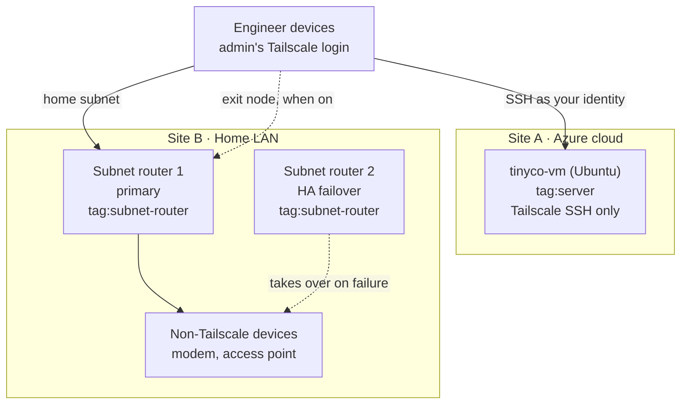

# Layer 2: Network (Tailscale)

**Author:** Will Chang, Zero Trust AI Engineer  
**Audience:** IT Administrator  
**Last Updated:** September 2026  
**Repository:** https://github.com/willshchang/WSHC-ZTAI-Lab  

---

## Overview

The network layer of the WSHC ZTAI Lab. Once a user has signed in to
the tailnet, this layer decides which machines they can actually
reach, over which ports, and how. (The tailnet does not use Layer 1's
Entra ID for sign-in yet; see the identity note under Architecture.)

This layer controls **Reachability**: what can reach what.

Built on Tailscale, a WireGuard-based mesh network, and managed
entirely through Terraform. There is no traditional "inside" network:
being connected to the tailnet grants nothing by itself. Every
connection is checked against the ACL policy.

**Status:** Live. The tailnet, Azure VM and both subnet routers are
running and managed by the code in this folder.

---

## What This Layer Does

| Capability | What it does in plain English |
|---|---|
| **ACL Policy as Code** | The network rulebook lives in `acl.tf`: grants, tag ownership and built-in tests. Anything not explicitly allowed is blocked. |
| **Device tags** | Machines are identified by their job (`tag:server`, `tag:subnet-router`), not by who set them up. |
| **Tailscale SSH** | Log in to servers with your identity. No SSH keys to manage, and port 22 is closed to the internet. |
| **Subnet routing** | Reach devices that can't run Tailscale (modems, printers, legacy servers) through a router device. |
| **High availability** | Two subnet routers advertise the same network. If one goes down, traffic moves to the other automatically. |
| **Exit nodes** | Route internet traffic through a trusted device on the tailnet. |
| **Automated enrollment** | Terraform generates short-lived, single-use auth keys so servers join without a human logging in. |

---

## Architecture



Each labelled solid arrow is a grant in `acl.tf`; anything not granted is blocked.
The Azure VM has no grant to the home LAN: it is internet-facing, so ACL deny
tests prove it cannot reach the home subnet or the subnet routers.
Terraform manages the ACL, device tags, route approvals and auth keys for both
sites.

> **Identity today:** the only person on the tailnet is the admin, who signs in
> to Tailscale with a personal identity provider. Entra ID is not the tailnet's
> identity provider yet, so Entra Conditional Access and MFA do not gate tailnet
> sign-in. Moving the tailnet to Entra ID, and using SCIM-synced Entra groups in
> the ACL, is a planned step.

| Site | Devices | Role |
|---|---|---|
| **Site A: Azure cloud** | `tinyco-vm` (Ubuntu 24.04) | Server, Tailscale SSH target, tagged `tag:server` |
| **Site B: Home LAN** | Two Apple TVs | Primary and HA subnet routers for `192.168.1.0/24`, tagged `tag:subnet-router` |
| **Engineer devices** | Windows PC, iPad, iPhone | Identified by user identity, no tags |

---

## Repository Structure

```
02-network/
│
├── README.md                        ← you are here
├── terraform/
│   ├── providers.tf                 ← Tailscale provider, OAuth authentication
│   ├── variables.tf                 ← all inputs, zero hardcoded values
│   ├── acl.tf                       ← grants, Tailscale SSH rules, tag owners, tests
│   ├── tags.tf                      ← device tag assignments
│   ├── dns.tf                       ← MagicDNS
│   ├── tailnet_settings.tf          ← HTTPS certificates, device auto-updates
│   ├── subnet-routes.tf             ← subnet route approvals for the HA pair
│   ├── keys.tf                      ← auth key generation for server enrollment
│   └── terraform.tfvars.example     ← template, copy to terraform.tfvars
│
└── docs/
    ├── 01-Subnet_Router_Setup_and_Troubleshooting.md
    ├── 02-ACL_Tags_and_Access_Control.md
    ├── 03-Network_Architecture.md
    ├── 04-Tailscale_SSH_Setup_and_Troubleshooting.md
    └── iac/                         ← one doc per Terraform file
```

---

## Key Design Decisions

### Default deny
Tailscale blocks anything the ACL policy doesn't explicitly allow. The
policy only lists what is permitted, so there are no deny rules to
maintain and nothing is open by accident.

### Identity and machine access are separate
A grant for a person (`admin_email`) and a grant for a machine
(`tag:server`) are independent. Removing a server's access to a
network does not remove the engineer's access, and the reverse.

### Tag ownership chain
Terraform's OAuth client is assigned `tag:terraform`, and
`tag:terraform` owns `tag:server` and `tag:subnet-router`. This is
what allows Terraform to enroll servers automatically, while a human
still controls who owns `tag:terraform`.

### Two layers of control over a route
A subnet route has to be advertised by the router **and** allowed by
the ACL policy. Turning off the route removes the path entirely.
Removing the ACL grant blocks traffic even while the path exists.

### Import blocks for provider defaults
Tailscale creates a default ACL and DNS settings on every new tailnet.
Import blocks let Terraform adopt those defaults on first run, so the
code works against a brand new tailnet without errors.

### DNS names over hostnames
Some devices, including Apple TV, report a generic hostname through
the API. Data sources look devices up by their unique MagicDNS name
instead.

---

## Quick Start

Full prerequisites and the manual steps are in
[00-IaC-Overview.md](./docs/iac/00-IaC-Overview.md).

```bash
cd 02-network/terraform
cp terraform.tfvars.example terraform.tfvars
# fill in the OAuth client and the full device DNS names (host.<tailnet>.ts.net)

terraform init
terraform plan        # review before changing anything
terraform apply
```

---

## Documentation Guide

| Goal | Document |
|---|---|
| Deploy this layer and understand the IaC boundary | [00-IaC-Overview.md](./docs/iac/00-IaC-Overview.md) |
| Network design and site-to-site routing | [03-Network_Architecture.md](./docs/03-Network_Architecture.md) |
| ACL policy, grants and tags | [02-ACL_Tags_and_Access_Control.md](./docs/02-ACL_Tags_and_Access_Control.md) |
| Subnet routers, HA failover and troubleshooting | [01-Subnet_Router_Setup_and_Troubleshooting.md](./docs/01-Subnet_Router_Setup_and_Troubleshooting.md) |
| Tailscale SSH setup and troubleshooting | [04-Tailscale_SSH_Setup_and_Troubleshooting.md](./docs/04-Tailscale_SSH_Setup_and_Troubleshooting.md) |
| Auth keys and the tag ownership chain | [08-keys.md](./docs/iac/08-keys.md) |

---

## Security Notes

- OAuth credentials live only in `terraform.tfvars`, which is gitignored
- Auth keys are single-use, tagged, expire after one hour, and are passed to `tailscale up` from a root-only file, never on the command line
- Port 22 is closed at the Azure network security group; SSH is Tailscale SSH only
- Root SSH uses a `check` rule: the admin must re-authenticate in the browser if the last check is older than `ssh_root_check_period` (default 12h). Other Linux users use `accept`
- ACL tests run on every apply: accept tests reject any policy that would lock the admin out, deny tests reject any policy that opens the VM to the home LAN or connects the VM and the subnet routers

---

## Official References

| Topic | URL |
|---|---|
| Tailscale Terraform provider | https://registry.terraform.io/providers/tailscale/tailscale/latest/docs |
| Tailscale ACL policy syntax | https://tailscale.com/docs/reference/syntax/policy-file |
| Tags and tag ownership | https://tailscale.com/docs/features/tags#ownership |
| Subnet routers | https://tailscale.com/docs/features/subnet-routers |
| High availability | https://tailscale.com/docs/how-to/set-up-high-availability |
| Tailscale SSH | https://tailscale.com/docs/features/tailscale-ssh |
| Configuration audit logs | https://tailscale.com/docs/features/logging/audit-logging |
| Network flow logs | https://tailscale.com/kb/1219/network-flow-logs |
| Auth keys | https://tailscale.com/docs/features/access-control/auth-keys |
