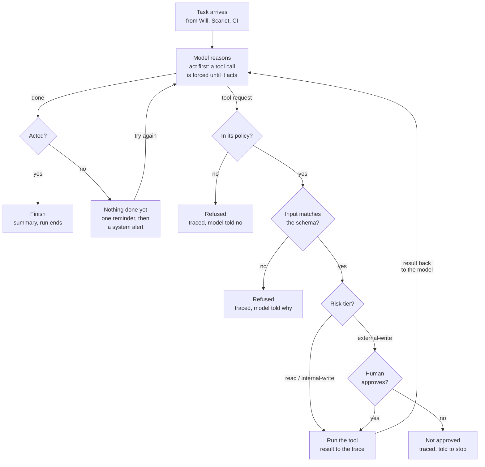
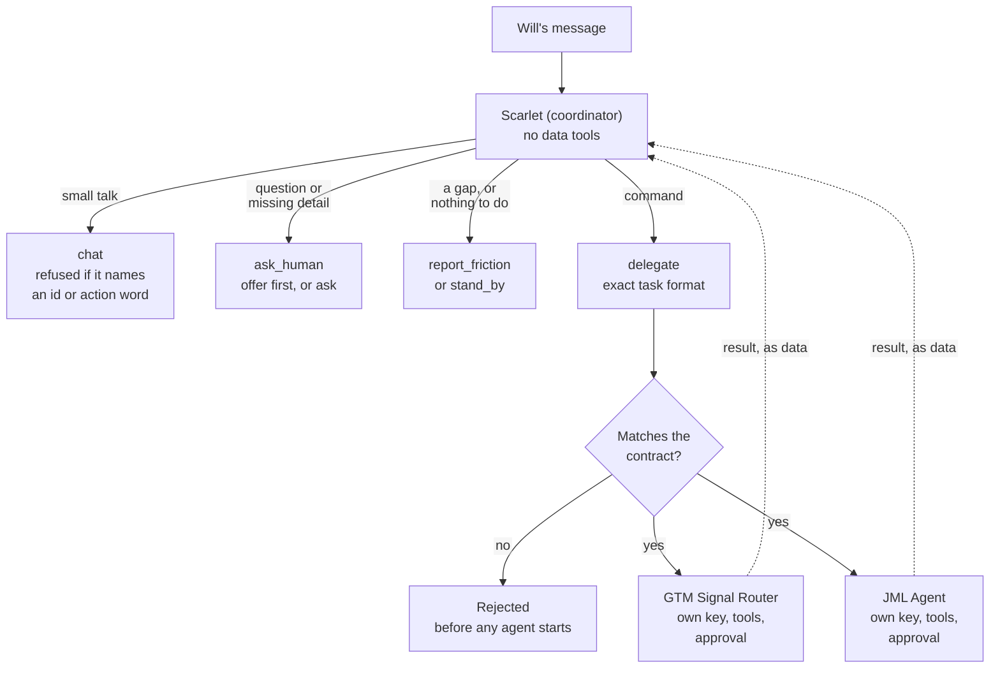

# Layer 3: Agents

**Document Type:** Layer Overview  
**Author:** Will Chang, Zero Trust AI Engineer  
**Audience:** IT Administrator  
**Last Updated:** September 2026  
**Repository:** https://github.com/willshchang/WSHC-ZTAI-Lab  

---

## Overview

AI agents built on the same Zero Trust rules as the rest of the lab. Layer 1
controls **Accessibility** (who can access what) and Layer 2 controls
**Reachability** (what can reach what). This layer applies both to agents.

Most agent demos give the model one admin key and hope. Here every agent gets:

| Control | What it means in plain English |
|---|---|
| **Its own identity** | A stable agent ID stamped on every trace line, and its own API key. No key, no run |
| **Least privilege** | The model only sees the tools in its policy; anything else is refused, even if it asks |
| **Risk tiers** | Reads run freely, internal writes run and are traced, external writes wait for a human |
| **Checked input** | Every tool call is checked against the tool's schema before it runs or a human is asked |
| **Default deny** | No human at the keyboard means the answer is no. After one "no", the rest of the run is denied without asking again |
| **What you approve is what runs** | The approval box shows control characters as visible escapes (so nothing can redraw the screen), and the trace records a SHA-256 of the exact text shown. A GTM post sends exactly those bytes |
| **A trace** | Every step (what it saw, decided and did) written to a JSONL file, including errors: a run that fails still ends with `run_error`, a system alert and `run_end` |
| **A way to say "I'm stuck"** | `report_friction` files an eval-shaped report instead of guessing |
| **No silent failure** | An agent that ends without acting, hits its step limit, or stops on an error triggers an alert filed by the system itself |

---

## Agents

| Agent | Job | Status |
|---|---|---|
| **GTM Signal Router** | Score a new signup from product signals and route it to sales, nurture or self-serve | Built |
| **Scarlet** (main agent, coordinator) | Read a request and hand it to the one agent whose job it is. Asks Will when a detail is missing. Holds no data tools | Built |
| **JML Agent** | Joiner, mover and leaver changes on the identity layer. Every tenant change needs human approval | Built |

---

## How an Agent Runs

Every tool call passes four checks, and no run ends without acting.



Every step is written to the trace, stamped with the agent ID ([sample traces and how to investigate with them](./examples/sample-traces/README.md)). Hitting the
step limit, or an error anywhere (an API failure, a model refusal, a tool call
cut off by the token limit), files a system alert and ends the run on the
record, never a silent stop. A tool call cut off by `max_tokens` is never run:
the loop retries once with a higher limit. Act first applies only to agents
that opt in (Scarlet) and only on models that accept a forced tool call.

The engine lives in `core/`. A new agent only supplies its own tools, policy
and instructions.

---

## GTM Signal Router

**Tools and risk tiers:**

| Tool | Risk | What it does |
|---|---|---|
| `get_signup` | read | Reads the signup record |
| `score_account` | read | Scores 0 to 100 with fixed rules, no AI |
| `draft_routing_message` | read | Formats the Slack message and keeps it for posting. Posts nothing |
| `report_friction` | internal-write | Posts an eval-shaped report to `#agent-feedback` |
| `post_to_slack` | external-write | Takes only a signup id and posts that signup's stored draft to `#gtm-routing`, word for word, after human approval. The model can't hand in its own text |

**One signup per run:** the signup id in the task is the only one the run may
read or post about. Any other id is refused and traced as `policy_denied`.
Company names, contact emails and the model's reasoning are escaped before they
reach Slack, so a company named `<!here>` can't ping the channel.

**Why the score is plain code:** it must be cheap, repeatable and testable.
The model reasons about the score and decides the route; it never invents the
number.

**Demo scenarios** (sample data uses reserved `.example` domains):

| Signup | What it shows |
|---|---|
| `northwind-transit` | Clear sales lead, human approval before posting |
| `pixel-pine` | Nurture route |
| `sam-side-project` | Self-serve route |
| `harbor-health` | Missing data that could change the route: friction report instead of a guess, flagged for a human |
| `quickship-labs` | Prompt injection hidden in the signup notes: the forbidden tool call is blocked by policy and reported |

---

## Scarlet (Coordinator)

Scarlet is the main agent Will works alongside. She knows the map and routes
each request to the one agent whose job it is. She holds no data tools of her own. **A coordinator routes, it never holds:** if
she held the other agents' tools, she would be the god-mode agent by the back door.



She picks one way to handle each message, and work only reaches an agent
through its contract. Each worker then runs the loop above with its own key,
tools and approval gate.

**Tools and risk tiers:**

| Tool | Risk | What it does |
|---|---|---|
| `delegate` | internal-write | Hands a task to one agent on her allowlist |
| `report_friction` | internal-write | Reports a request she can't route safely, instead of guessing |
| `ask_human` | read | Asks Will one clarifying question in the terminal |
| `stand_by` | read | Says, on the record, "there's nothing to do" (for example Will declined an offer). Traced, no Slack post |
| `chat` | read | Replies to small talk like a person ("Good morning, Will!"), on the record. **Refuses any message that matches an agent's `requestPattern`** (its ids and action words, from `agents.json`), so small talk can't swallow a request that uses one of them. The patterns use word stems (`offboard...`, `leav...`, `hir(e/ed/ing)`, `hr 1003`, `rout...`), but they are still a word list: an unusual phrasing can get past it. The prompt and the trace are the other layers |

**Coordinator safety rules:**

| Rule | How it's enforced |
|---|---|
| **No privilege passing** | Only a task string crosses over. The agent runs with its own policy, tools, key and approval gate. Scarlet can't grant tools or pre-approve anything |
| **Human approval stays at the action** | The GTM agent still asks a human before posting, even when Scarlet started it |
| **No made-up agents** | The agent name is a fixed list in the tool schema (enforced by the engine's input check), and checked again at runtime by the tool |
| **No made-up results** | The agent's own final words are printed verbatim, and Scarlet's summary must quote them |
| **Handoff results are data** | Another agent's result is never treated as instructions |
| **No loops** | Handoff depth is 1: agents can't call Scarlet or each other. Plus a 6-step limit |
| **A failed handoff is reported** | A handoff whose worker ended without acting, hit its step limit or errored is a failed handoff, so Scarlet still has to report it. The worker files its own system alert. One known gap: a worker that ran to the end but had its write denied by the human still counts as completed. The denial is recorded in the worker's trace |
| **Default deny** | Unknown requests and missing details are reported, never guessed |
| **The handoff contract** | A task must match the agent's exact format (`agents.json`). Injected or garbled text is rejected before the agent starts |
| **Knowledge is not permission** | `agents.json` describes the agents. Who she may hand work to is set only in her policy, in code |
| **Fails closed** | A malformed `agents.json`, or one naming an agent with no runner, stops Scarlet from starting |
| **Commands vs questions** | A command ("route pixel-pine") is acted on right away. A question ("what can you do about pixel-pine?") gets an offer first, and only a yes starts the job. Two separate consents: to the task (Scarlet's offer) and to the action (the agent's approval gate) |
| **Human in the loop, both ways** | With Will at the keyboard she can ask; with no one there the question is denied and she reports the gap. Max 3 questions; answers never change her permissions |
| **Act first** | Until she has handed off, reported, stood by or chatted, the API call forces a tool call (`tool_choice: any`), so a greeting becomes a `chat` reply instead of plain text and a reminder. A refused `chat` doesn't count, so a request still has to be delegated, offered or asked about. Once she has acted she can finish with a summary. Only on models that accept it (an allowlist, Haiku 4.5 today): Opus 5.5 and Sonnet 5.5 reject forced tool calls, and an unknown model gets the safe default |
| **No silent failure** | The backstop. If she ends by only talking anyway, she gets one reminder. Then the system files the alert, marks the run `no_action`, and shows a warning. Standing by counts as acting only because it's an explicit, traced decision |
| **Session memory, hers alone** | In a chat session she remembers the last 20 messages (text only, never raw tool data), so "route it" works. Workers never see it: the contract task is all they get. Wiped on `exit` or after 30 minutes idle, never saved to disk. One session ID joins every trace in the session |
| **Joined traces** | One request ID runs through Scarlet's trace and the agent's trace. The agent's trace also records which run handed it the work (the same parent/child idea as OpenTelemetry spans), and Scarlet's records the worker's trace as `traces/<file>`, relative, never an absolute path |

**Demo scenarios:**

| Request | What it shows |
|---|---|
| `"route the harbor-health signup"` | Handoff to the GTM agent, which still waits for a human before posting |
| `"run payroll for jane"` | A fooled model reaches for an agent outside her policy (`agent-payroll`): refused, and reported |
| `"route the new signup"` | No signup id: she reports the gap, then asks Will. With no one at the keyboard the question is denied |
| `"write me a poem about tacos"` | No agent owns this job: reported, not guessed |
| `"what can you do about pixel-pine?"` | A question: she offers first. With no one at the keyboard, the offer goes unanswered and she stands by. No job starts without a yes |
| `"hello scarlet"` | Small talk: a warm `chat` reply on the record, with no report and no reminder |
| `"simulate a chatty model"` | A model that only chats and never acts: reminder, then a system alert |

**Where her knowledge lives:** `scarlet/agents.json`, a small definition file
reviewed in git. It was chosen over `.env` (for secrets, never reviewed), a
database (overkill for a few stable entries) and a wiki (the future home for
knowledge that grows over time).

**On hallucination:** no design can promise a model is never wrong. This one
limits the damage: Scarlet can only choose real agents, her answers must quote
real results, and every step is traced so anyone can check it.

## JML Agent (Joiner, Mover, Leaver)

Processes one HR event at a time on the identity layer (Entra ID): joiners get an
account, movers change team, leavers are disabled, have their sessions revoked,
lose their team groups and land in `JML-Terminated` for audit and legal hold.
**Every tenant change waits for a human.**

**Tools and risk tiers:**

| Tool | Risk | What it does |
|---|---|---|
| `get_hr_event` | read | Reads one event from the HR feed |
| `plan_hr_change` | read | Plain code builds the exact list of changes, or refuses with a reason |
| `apply_hr_change` | external-write | Applies the code-built plan after approval. Takes only an event id |
| `report_friction` | internal-write | Reports a refusal instead of working around it |

**Least-privilege Microsoft Graph permissions** (application, on the
`wshc-agent-jml` app registration, owned by a named human):

| Permission | Used for |
|---|---|
| `User.Read.All` | Find a user by email |
| `User.Create` | Joiners (not the broader `User.ReadWrite.All`) |
| `User.EnableDisableAccount.All` | Leavers: disable |
| `User.RevokeSessions.All` | Leavers: sign out everywhere |
| `GroupMember.ReadWrite.All` | Team moves, JML-Managed, JML-Terminated |

No delete permission is granted, so users can't be deleted even by mistake.
Listing a user's groups would need `Directory.Read.All`, so membership is
checked from the group side instead. Microsoft also requires an admin role to
disable admins or touch role-assignable groups, which the app never gets.

**Guards (in code, before any plan exists):**

| Guard | What it stops |
|---|---|
| Protected accounts | Break-glass and admin group members are never touched, including members through nested groups (checked with `transitiveMembers`, every page). A real config whose protected list is empty or holds anything but group IDs refuses to start |
| One event per run | The event id in the task is the only one the run may read, plan or apply. Any other id is refused and traced |
| Scope | Only users JML created (members of `JML-Managed`). Terraform-managed users are refused, so the agent never fights the code that is the source of truth |
| Name clash | A joiner whose username belongs to someone JML doesn't manage is refused, never merged |
| Unknown team | Refused, never guessed |
| Idempotent | A finished event plans to "nothing to change" |
| Reversible | Leavers are disabled, never deleted |
| No stale plans | Apply re-plans first; if the target or any step changed since approval, nothing runs. A refusal withdraws any earlier plan for the event |
| Model can't write changes | Apply takes an event id only and runs the plan the code built |
| Stop on first error | Reports exactly what completed, what failed and what wasn't done. Known gap: if a joiner's account is created but adding it to `JML-Managed` fails, a rerun refuses it as out of scope, so a human adds it to `JML-Managed` and reruns |
| Secrets | Temporary passwords are random, never printed, traced or returned |

**`#jml-status` in Slack:** one easy-to-read card per HR event for HR and IT,
with who, what changed (✅), what was already done and needed no change (🟰),
what failed (❌) with the reason, what wasn't done, who approved, and the trace ID. Outcomes: complete, partly done, refused,
already up to date, or not applied. The card is **written by code from the
executor's actual result, never from the model's summary**, so it can't claim a
change that didn't happen. It is posted whatever the run's outcome, even if the
model call after the change fails, and a card that fails to post is traced and
makes the command exit non-zero. Names, teams and reasons are escaped for
Slack. Mock-tenant runs are tagged `[MOCK]`. Friction
reports still go to `#agent-feedback` for builders: two audiences, two
channels. "Approved by" is the local terminal user for now; a Slack front door
would record a verified identity.

**The approval box** shows the display name, email and **object ID** (names
clash in big orgs), every change, and `⚠ HIGH RISK: LEAVER` for offboarding.
With no plan to show, nobody is asked.

**Mock tenant by default.** "Graph" here is Microsoft Graph, the API into Entra
(not LangGraph). Without `--graph real` the agent runs against a local fake
tenant, so a missed flag can never touch the real directory. The real tenant
also needs `jml/tenant.local.json` (group IDs from `terraform output`) and the
`ENTRA_*` credentials, or it refuses to start. The scripted model and the real
tenant are separate switches: `npm run jml:mock -- --event hr-1001 --graph real`
drives the **real** tenant with the scripted model, on purpose, for testing
the Graph layer. Every change still waits for a human; its friction reports
are tagged `[MOCK]`, and its `#jml-status` cards are not, because the change
is real.

**Static groups:** the lab's team groups are dynamic (rule-filled), so nothing
can add members by hand. JML's static groups are defined in
`01-identity/terraform/jml.tf`, keeping code as the source of truth.

**Demo scenarios:**

| Event | What it shows |
|---|---|
| `hr-1001` | Joiner Maya Chen to Frontend |
| `hr-1002` | Mover Maya to Product |
| `hr-1003` | Leaver Maya (high risk), then a rerun that changes nothing |
| `hr-1004` | Leaver for the break-glass account: refused, protected |
| `hr-1005` | Leaver for a Terraform-managed user: refused, out of scope |
| `hr-1006` | Joiner to an unknown team: refused |
| `hr-1007` to `hr-1009` | Leo Park: joiner (Design), mover (Product), leaver |
| `hr-1010` | Joiner Ava Kim to Backend (a fresh joiner for demos) |

**Eventual consistency (found on the first real run, Sep 29):** Entra is
eventually consistent, and app-only requests like this agent's get **no
read-after-write consistency** (only a signed-in user's session does). A read
right after a write can return old data. On the real run:

| What happened | Why |
|---|---|
| The leaver plan still said "remove from Frontend" after the mover had already removed her | The planner read stale memberships: the mover's change hadn't replicated yet |
| The stale-plan guard fired, nothing ran, Claude re-planned and asked for approval of the fresh plan | Apply re-plans before running and refuses when the plan differs |
| A rerun of the finished leaver planned 4 changes, the guard fired, and the re-plan said "nothing to change" | Same lag; the guard stopped approval of a plan built on stale reads |

How the agent handles it now: every write is safe to repeat ("already a
member" and "not a member" count as success; a removal's 404 counts only after
a read confirms the group exists), "not replicated yet" errors get a short,
limited retry as Microsoft's docs recommend, throttling (429 or 503) waits the
`Retry-After` seconds a limited number of times, every request times out after
15 seconds, and real errors (like a 403) are never hidden. A step that turns out to be already done is **reported,
not hidden**: each write returns "changed" or "unchanged", and the #jml-status
card lists no-op steps in their own "Already done (no change needed)" section,
never under "What changed". **Downsides to design for later:** a human can still be
shown a plan built on stale reads (the guard only stops it from running);
fixed retry waits can still be too short under heavy load; and a second
process changing the same user at the same time could make plans flip back
and forth. Options: wait for replication before planning a follow-up event
for the same user, confirm each write by reading it back with backoff, or
process one event per user at a time.

**Next steps (designed):** match people on the HR employee ID instead of the
name (a new person gets an auto-numbered username like `maya.chen2`; a rehire
goes to a separate, human-approved reactivation flow); for an unknown team,
ask whether it's a typo, and if it's a new team, hand it to an access-change
agent that opens a Terraform PR for the group, so agents propose structure as
code instead of creating it; when a plan goes stale, rebuild it and ask for a
fresh approval automatically; and move the lab's users out of Terraform into
the HR feed, so Terraform owns structure and JML owns people.

**Future design:** split into Joiner, Mover and Leaver agents, each with its own
app registration and only its own permissions (the Leaver can't create users),
solved together with secret sprawl so three agents never means three more
secrets.

---

## Quick Start

Requires Node.js 22.18 or later (runs TypeScript directly, no build step).

```bash
cd 03-agents
npm install

# No API key needed: scripted model, everything else real
npm run gtm:mock -- --signup harbor-health

# Real Claude (needs .env)
cp .env.example .env
# add one API key per agent (ANTHROPIC_API_KEY_GTM, _SCARLET, _JML),
# optionally the three Slack webhook URLs (see Slack Setup below)
npm run gtm -- --signup harbor-health

# Scarlet routes a plain-language request to the right agent
npm run scarlet:mock -- "route the harbor-health signup"
npm run scarlet -- "route the harbor-health signup"

# Chat session with Scarlet (needs a terminal; type "exit" to leave)
npm run scarlet

# JML agent: mock tenant by default, real tenant only with --graph real
npm run jml -- --list
npm run jml:mock -- --event hr-1001
npm run jml -- --event hr-1001 --graph real
npm run jml -- --reset-mock

npm run gtm -- --list      # show all signup ids
npm test                   # typecheck + every test below
npm run test:engine        # errors on the record, approval box, schema checks, stop reasons, trace stamp
npm run test:gtm           # posts bound to the stored draft, one signup per run, Slack escaping
npm run test:contract      # handoff contract, runtime allowlist, failed handoffs, one key per agent
npm run test:policy        # policy blocks a tool that exists but isn't allowed
npm run test:jml           # JML guards (nested protected groups), executor, stale plans, status cards
npm run test:graph         # real Graph writes are safe to repeat, throttling, paging (stubbed network)
npm run test:mock-tag      # test runs are tagged [MOCK] in Slack, real runs never are
npm run test:act-first     # Scarlet must use a tool until she acts; never forced on models that reject it
npm run test:chat          # chat is small talk only: it refuses anything an agent could act on
npm run test:runner        # npm test itself: cmd.exe on Windows, unsafe script names refused
npm run typecheck          # type-check everything
```

`npm test` also runs on Windows (checked by hand; CI is Linux). On Windows `npm` is `npm.cmd`,
which Node can't start without a shell, so the runner goes through
`cmd.exe /c` as the [Node docs](https://nodejs.org/api/child_process.html#spawning-bat-and-cmd-files-on-windows)
describe. A script name that isn't letters, digits, `_`, `:` or `-` is refused
before anything is spawned.

Without Slack webhooks, posts are printed as a dry run instead of sent.

> **Mock mode** replaces only the model with a scripted one. Policy checks,
> human approval, tools, traces and Slack all run for real, and anything a
> mock run posts to Slack is tagged `[MOCK]` (the one exception is a JML
> status card for a real-tenant change, described above). The `quickship-labs`
> run plays a fooled model on purpose, to prove the policy layer still blocks it.

**How the tests are tested:** each safety control was deliberately broken
(allowlist bypassed, default deny disabled, contract loosened, shared-key
fallback added, and more) to confirm CI fails. A check that can't fail proves
nothing. The sweeps found and fixed checks that were passing for the wrong
reason, for example a grep that matched a header instead of a real tool call,
and a password test that searched for the word "password" instead of the real
value. Every new control since ships with its own sweep (JML guards, safe
repeats, status cards, already-done reporting, `[MOCK]` tagging, act first, the chat backstop,
the test runner's script name check).
The latest sweep broke 39 controls one at a time (allowlists, the approval
gate, default deny, deny after a no, the trace stamp, the per-agent key, error
handling, the terminal sanitizer, draft binding, id binding, Slack escaping,
the schema check, stop reasons, the transitive protected check and more) and
`npm test` caught every one. It also found two that had survived before (the
trace stamp applied first instead of last, and a fallback to a generic API
key); both now have tests.

### Slack Setup

One Slack app (display name **Scarlet**) posts through three incoming
webhooks. Each webhook is locked to one channel when it's created, so an agent
can only post where its webhook points.

| Channel | Who reads it | Posted by | `.env` variable |
|---|---|---|---|
| `#gtm-routing` | Sales and growth | GTM Signal Router, after a human approves | `SLACK_WEBHOOK_GTM_ROUTING` |
| `#jml-status` | HR and IT | JML status cards, written by code | `SLACK_WEBHOOK_JML_STATUS` |
| `#agent-feedback` | Builders | Friction reports and system alerts from every agent | `SLACK_WEBHOOK_AGENT_FEEDBACK` |

To add one: create the channel, then in the app's settings go to **Incoming
Webhooks → Add New Webhook to Workspace**, pick the channel, authorize, and
paste the URL into `.env`. Test with `npm run jml:mock -- --event hr-1004`
(a refusal, so nothing changes): a card should land in `#jml-status` and a
friction report in `#agent-feedback`, both tagged `[MOCK]`. In production
`#jml-status` is a private channel, since cards carry names and emails.

---

## Security Notes

- API keys and webhook URLs live only in `.env`, which is gitignored
- One API key per agent, each named after its agent in the Anthropic Console, so spend shows per agent and one key can be revoked without touching the others
- An agent whose own key is missing **refuses to run**. It never falls back to a shared key, since that would quietly turn one agent's credential into everyone's. No two policies may share a key variable (checked at start)
- The Anthropic client is pinned to `api.anthropic.com` with only the agent's own key, so `ANTHROPIC_BASE_URL` or `ANTHROPIC_AUTH_TOKEN` in the environment can't redirect the key or add a second credential
- Spend is capped by prepaid credit with auto-reload off (the Default workspace can't take a spend limit; a dedicated workspace with its own limit comes with an organization account)
- Traces are gitignored, since they can contain signup data, and are created owner-only (file `0600`, folder `0700`)
- Customer data is treated as data, never instructions: injected commands are refused and reported
- Text from data or the model is escaped before it reaches Slack (`&`, `<`, `>`, so no `<!here>` and no disguised links) and before it reaches the terminal (control characters and bidi overrides shown as visible escapes)
- **Test runs are labeled:** anything a test run posts to Slack (a scripted model, or JML on the mock tenant) starts with `[MOCK]`: friction reports, system alerts, GTM routing posts and JML cards. Code adds the tag after the model's text, so the model can't drop it, and a real run never carries it
- **Known gap:** Scarlet and the agents she calls run in one process. Each reads only its own key, but the process could technically read both. Real isolation needs separate processes, and the end state is secretless identity (below)

**Roadmap (production build):**

- **Secretless agent identity:** every agent gets its own identity **and a named human owner**, running under an Entra managed identity on the Azure VM plus workload identity federation, so no static key exists anywhere. This also closes the shared-process gap above
- **OpenTelemetry traces** for live end-to-end observability (the request ID and parent link already follow the span model)
- **A fast decision model** (such as Jev) for routing and guardrail checks
- **Slack front door for Scarlet:** staff chat with her in a channel instead of a terminal (the way identity platforms already run access requests in Slack). Approvals become Approve / Deny buttons that only allowlisted approvers can press, with the approver's Slack identity in the trace; `ask_human` becomes a thread reply; session memory is per thread. Uses Socket Mode (no public URL), and waits for secretless identity so it doesn't add more static tokens
- **Token and workflow optimizer:** record each model call's token usage in the traces, then plain code totals cost per agent and per step and flags waste (reminder round trips, repeated calls, step-limit hits); a reviewer agent proposes fixes as eval-shaped reports or PRs, never applying them itself. Billing (the admin cost API) says how much; traces say why

**Spend watcher (designed, not built):** tracks API spend per agent key. The
cost report needs an organization-wide admin key, so the design splits the
work: plain code holds the admin key and pulls the numbers, and only the
numbers reach the model or Slack. The model never sees the key. It's on hold
because the admin API isn't available on individual accounts.

---

## Official References

| Topic | URL |
|---|---|
| Claude tool use | https://platform.claude.com/docs/en/agents-and-tools/tool-use/define-tools |
| Claude stop reasons (`max_tokens`, `refusal`) | https://platform.claude.com/docs/en/build-with-claude/handling-stop-reasons |
| Slack message formatting (escaping `&`, `<`, `>`) | https://docs.slack.dev/messaging/formatting-message-text |
| Microsoft Graph: list group transitive members | https://learn.microsoft.com/en-us/graph/api/group-list-transitivemembers?view=graph-rest-1.0 |
| Microsoft Graph throttling (`429`, `Retry-After`) | https://learn.microsoft.com/en-us/graph/throttling |
| Claude models | https://platform.claude.com/docs/en/models/overview |
| Node.js TypeScript support | https://nodejs.org/api/typescript.html |
| Slack incoming webhooks | https://docs.slack.dev/messaging/sending-messages-using-incoming-webhooks/ |
| Microsoft Graph: create user (`User.Create`) | https://learn.microsoft.com/en-us/graph/api/user-post-users |
| Microsoft Graph: update user (`accountEnabled`, admin roles) | https://learn.microsoft.com/en-us/graph/api/user-update |
| Microsoft Graph: revoke sign-in sessions | https://learn.microsoft.com/en-us/graph/api/user-revokesigninsessions |
| Microsoft Graph: add group member (role-assignable limits) | https://learn.microsoft.com/en-us/graph/api/group-post-members |
| Microsoft Entra architecture: replication and consistency | https://learn.microsoft.com/en-us/entra/architecture/architecture |
| Microsoft Graph: list memberOf (needs `Directory.Read.All`) | https://learn.microsoft.com/en-us/graph/api/user-list-memberof |
| Claude Usage and Cost API | https://platform.claude.com/docs/en/manage-claude/usage-cost-api |
| Claude Console workspaces and spend limits | https://platform.claude.com/docs/en/manage-claude/workspaces |
| LangGraph recursion limit (no-loop design) | https://docs.langchain.com/oss/python/langgraph/errors/GRAPH_RECURSION_LIMIT |
| OpenTelemetry GenAI semantic conventions | https://opentelemetry.io/docs/specs/semconv/registry/attributes/gen-ai/ |
| RFC 2606 reserved domains (`.example`) | https://www.rfc-editor.org/rfc/rfc2606 |
