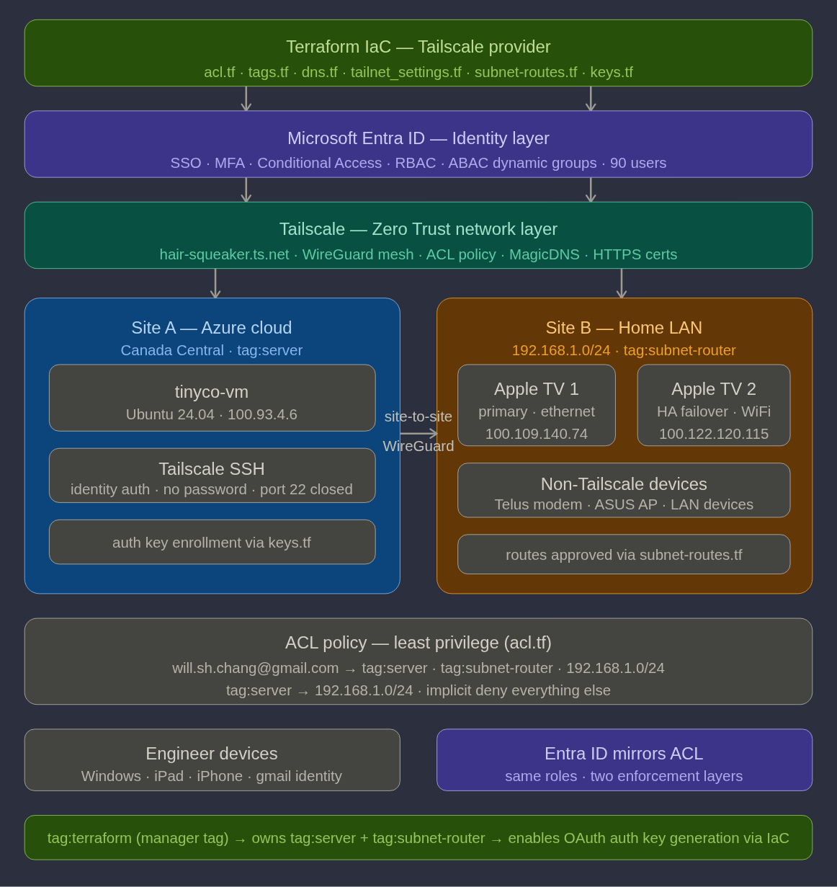
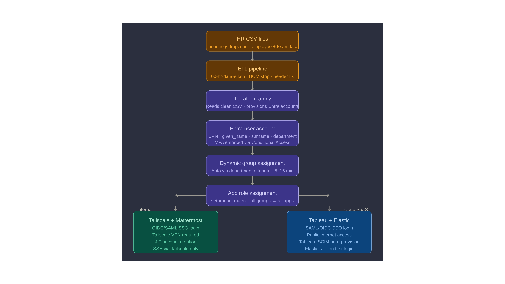

# WSHC ZTAI Lab

**Zero Trust Architecture for Identity, Network and AI Agents**

**Document Type:** Repository Overview  
**Author:** Will Chang, Zero Trust AI Engineer  
**Last Updated:** September 2026  
**Repository:** https://github.com/willshchang/WSHC-ZeroTrust-IaC-Lab  

---

## The Scenario

TinyCo is a fictional 90-person company with 9 teams, moving from a
traditional office network to a remote-first way of working.

This lab takes TinyCo from a raw HR export to a full Zero Trust
architecture, built entirely as code:

```
HR CSV export
  → ETL pipeline (sanitise and stage the data)
    → Terraform
      → Entra ID: users, groups, roles, MFA, SSO, SCIM      (Layer 1: Identity)
        → Tailscale: ACL policy, tags, SSH, subnet routing  (Layer 2: Network)
```

Every user, group, role, app assignment and network rule comes from
code. Nothing is clicked into existence by hand.

---

## Deployment Status

| Layer | Status |
|---|---|
| **Layer 1: Identity (Entra ID)** | Deployed and validated on a live Microsoft Entra ID tenant during the Microsoft 365 E5 trial (late spring 2026). The trial has since ended. All Terraform code and deployment documentation are retained. |
| **Layer 2: Network (Tailscale)** | Live. Tailnet, Azure VM and both subnet routers are running and managed by Terraform. |

> **Note:** Layer 1 was originally deployed to the tenant
> `TinyCoDDG.onmicrosoft.com`. The docs use `<tenant>.onmicrosoft.com`
> as a placeholder so the code stays portable to any tenant.

---

## Zero Trust Architecture

Zero Trust means nothing is trusted just because it is "inside" the
network. Every request has to prove who is asking and whether they are
allowed, every time.

This lab enforces that with two independent layers. A user has to pass
**both** before reaching anything.

| Layer | Question it answers | Tool |
|---|---|---|
| **1. Identity** | Who are you, and what are you allowed to use? | Microsoft Entra ID |
| **2. Network** | Which machines can you actually reach, and how? | Tailscale |
| **Cross-cutting: IaC and Automation** | How is all of this built, changed and checked? | Terraform, Bash, GitHub Actions |



### Layer 1: Identity (Entra ID)

| Capability | What it does in plain English |
|---|---|
| **CSV-driven provisioning** | 90 users created from an HR export. No names or company data in the code. |
| **ABAC dynamic groups** | Group membership follows the user's `department` attribute. Change the department, the access follows automatically. |
| **RBAC** | Roles granted to groups, never directly to people. One `setproduct()` loop assigns every group to every app it needs. |
| **Conditional Access** | MFA required for everyone. Legacy authentication (the old protocols that can't do MFA) is blocked. |
| **SSO** | Single sign-on to Tailscale (OIDC), Mattermost, Tableau and Elastic (SAML). |
| **SCIM** | Tableau accounts are created and removed automatically from Entra. |
| **Privileged Access (foundations)** | Admin roles only through dedicated role-assignable groups. Break-glass account with a group-based Conditional Access exclusion. |

### Layer 2: Network (Tailscale)

| Capability | What it does in plain English |
|---|---|
| **ACL Policy as Code** | The network rulebook lives in `acl.tf`: grants, tag ownership and built-in tests. Anything not explicitly allowed is blocked. |
| **Device tags** | Machines are identified by their job (`tag:server`, `tag:subnet-router`), not by who set them up. |
| **Tailscale SSH** | Log in to servers with your identity. No SSH keys to manage, and port 22 is closed to the internet. |
| **Subnet routing** | Reach devices that can't run Tailscale (printers, modems, legacy servers) through a router device. |
| **High availability** | Two subnet routers advertise the same network. If one goes down, traffic moves to the other with no dropped packets. |
| **Exit nodes** | Route internet traffic through a trusted device on the tailnet. |
| **Automated enrollment** | Terraform generates short-lived, single-use auth keys so servers can join without a human logging in. |

### Cross-cutting: IaC and Automation

| Capability | What it does in plain English |
|---|---|
| **Terraform, both layers** | Identity and network are managed by the same tool and the same review process. |
| **Dropzone ETL pipeline** | HR files are placed in `incoming/`, cleaned by a script, then staged for Terraform. Prevents a bad file from mass-deleting users. |
| **Zero hardcode** | All real values live in gitignored `terraform.tfvars` and CSV files. Swap them and the same code deploys to another company. |
| **CI validation** | GitHub Actions checks formatting and syntax on every push. |

---

## Identity Journey

How a new hire goes from an HR record to working access:



1. HR adds the person to the export with their team
2. The ETL script cleans the file and stages it
3. `terraform apply` creates the Entra ID account with the `department` attribute set
4. The dynamic group for that department picks the user up automatically
5. The group's app assignments give them SSO access to their team's apps
6. Signing in to Tailscale through Entra puts them on the network, where the ACL policy decides what they can reach

---

## Zero Trust Principles in This Lab

Mapped to the tenets in NIST SP 800-207:

| Principle | How this lab implements it |
|---|---|
| Every access request is authenticated and authorised | Entra ID SSO with MFA, then Tailscale ACL on every connection |
| Least privilege | Role and app access by group, network access by explicit grant, implicit deny for everything else |
| Access is decided per request, from identity and policy | Tailscale evaluates the ACL policy for each connection, not once at login |
| Network location grants nothing | No "inside" network. Port 22 closed. Being on the tailnet alone gives no access. |
| Policy is centrally managed and auditable | All policy in Terraform, version-controlled, reviewed and validated in CI |

---

## Repository Structure

```
WSHC-ZeroTrust-IaC-Lab/
│
├── README.md                ← you are here
├── docs/
│   └── diagrams/            ← architecture diagrams for both layers
│
├── 01-identity/             ← Layer 1: Entra ID
│   ├── README.md
│   ├── terraform/           ← users, groups, RBAC, Conditional Access, SSO apps
│   ├── scripts/             ← ETL pipeline, gallery app lookup
│   └── docs/                ← architecture, admin and end-user guides
│
├── 02-network/              ← Layer 2: Tailscale
│   ├── README.md
│   ├── terraform/           ← ACL, tags, DNS, settings, subnet routes, auth keys
│   └── docs/                ← subnet routing, ACL, network architecture, Tailscale SSH
│       └── iac/             ← one doc per Terraform file
│
└── .github/workflows/       ← CI validation for both layers
```

---

## Key Design Decisions

### Zero hardcode
No user names, device IDs or credentials exist in any `.tf` file.
Real values are injected from gitignored files at deploy time. This
keeps personal data out of the repo and makes the code reusable.

### Attributes drive access, not tickets
ABAC dynamic groups mean a department change in HR moves the user's
access automatically. No one has to remember to update a group.

### Twin group architecture
Microsoft only allows directory roles on static, role-assignable
groups. So each team has a dynamic group for app access and a separate
static group for admin roles. Privileged access stays deliberate and
never changes just because an attribute changed.

### Gallery-first app registration
SaaS apps are registered from the Microsoft Entra app gallery wherever
possible, because gallery templates come with the correct SSO setup.
Custom registrations are only used when no gallery app exists.

### Import blocks for provider defaults
Tailscale creates a default ACL and DNS settings on every new tailnet.
Import blocks let Terraform adopt and take over those defaults instead
of failing, so the code is safe to run against a brand new tailnet.

### Tag ownership chain for automation
Terraform's OAuth client is given `tag:terraform`, and `tag:terraform`
owns the infrastructure tags. This lets Terraform enroll servers
automatically without a human, while humans still control who owns
`tag:terraform` in the first place.

### Secret sprawl prevention
Credentials only exist in gitignored files. Auth keys are marked
sensitive, single-use and expire after one hour. In production these
would come from a secrets manager such as Azure Key Vault or
HashiCorp Vault.

---

## IaC Boundary

Terraform manages configuration through each vendor's API. Some steps
happen on the device itself and stay manual, which is normal for any
real deployment.

| Terraform manages | Manual step |
|---|---|
| Entra ID users, groups, roles, CA policies, app registrations | Creating the tenant and the Terraform service principal |
| Tailscale ACL policy, tags, DNS, HTTPS certs | Installing Tailscale on each device |
| Subnet route approvals | Turning on subnet routing on the Apple TVs |
| Auth key generation | Running `tailscale up --authkey=...` on the server |
| Tailscale SSH access rules | Turning on Tailscale SSH per machine (`sudo tailscale set --ssh`) |

---

## Quick Start

Each layer has its own full setup guide:

| Layer | Start here |
|---|---|
| Layer 1: Identity | [01-identity/README.md](./01-identity/README.md) |
| Layer 2: Network | [02-network/README.md](./02-network/README.md) |

Both layers deploy the same way once their prerequisites and
`terraform.tfvars` are in place:

```bash
cd 02-network/terraform           # or 01-identity/terraform
terraform init
terraform plan                    # review before changing anything
terraform apply
```

---

## Documentation Guide

| Goal | Document |
|---|---|
| Identity architecture and design decisions | [ARCHITECTURE.md](./01-identity/docs/ARCHITECTURE.md) |
| Recreate the identity layer from scratch | [01-setup-guide.md](./01-identity/docs/admin/01-setup-guide.md) |
| Roles, Conditional Access and break-glass | [02-security-model.md](./01-identity/docs/admin/02-security-model.md) |
| User and group lifecycle | [03-provisioning.md](./01-identity/docs/admin/03-provisioning.md) |
| End-user onboarding | [01-getting-started.md](./01-identity/docs/user/01-getting-started.md) |
| Network architecture | [03-Network_Architecture.md](./02-network/docs/03-Network_Architecture.md) |
| ACL policy and tags | [02-ACL_Tags_and_Access_Control.md](./02-network/docs/02-ACL_Tags_and_Access_Control.md) |
| Subnet routing and HA | [01-Subnet_Router_Setup_and_Troubleshooting.md](./02-network/docs/01-Subnet_Router_Setup_and_Troubleshooting.md) |
| Tailscale SSH | [04-Tailscale_SSH_Setup_and_Troubleshooting.md](./02-network/docs/04-Tailscale_SSH_Setup_and_Troubleshooting.md) |
| Network Terraform, file by file | [02-network/docs/iac/](./02-network/docs/iac/) |

---

## Roadmap

| Item | Why it matters |
|---|---|
| **PIM just-in-time roles** | Admins request elevation for a set time with approval, instead of holding permanent admin rights |
| **Tailscale SSH `check` mode** | Forces a fresh identity check before a privileged SSH session |
| **Terraform remote state** | Shared, locked state for team use instead of a local state file |
| **Automated access reviews** | Scheduled review of who still needs what |
| **`03-agents/`** | Extend the same identity and network controls to AI agents: scoped identities per agent, least-privilege tool access, network-level containment |

---

## Tech Stack

| Area | Technology |
|---|---|
| Identity | Microsoft Entra ID (M365 E5 trial) |
| Network | Tailscale |
| IaC | Terraform (`azuread`, `azurerm`, `tailscale` providers) |
| Compute | Azure VM, Ubuntu 24.04, Canada Central |
| SaaS (SSO) | Mattermost, Tableau Cloud, Elastic Cloud |
| Automation | Bash, GitHub Actions |

---

## Security Notes

- No credentials, personal data or real employee data in this repository
- HR CSV files, `terraform.tfvars`, certificates and keys are gitignored
- SSH port 22 is closed to the public internet; server access is through Tailscale SSH only
- Network policy is default deny; only explicit grants allow traffic

---

## Official References

| Topic | URL |
|---|---|
| NIST SP 800-207 Zero Trust Architecture | https://csrc.nist.gov/pubs/sp/800/207/final |
| Microsoft Entra ID documentation | https://learn.microsoft.com/en-us/entra/identity/ |
| Entra dynamic groups | https://learn.microsoft.com/en-us/entra/identity/users/groups-dynamic-membership |
| Conditional Access | https://learn.microsoft.com/en-us/entra/identity/conditional-access/overview |
| Terraform `azuread` provider | https://registry.terraform.io/providers/hashicorp/azuread/latest/docs |
| Tailscale Terraform provider | https://registry.terraform.io/providers/tailscale/tailscale/latest/docs |
| Tailscale ACL policy syntax | https://tailscale.com/docs/reference/syntax/policy-file |
| Tailscale SSH | https://tailscale.com/docs/features/tailscale-ssh |
