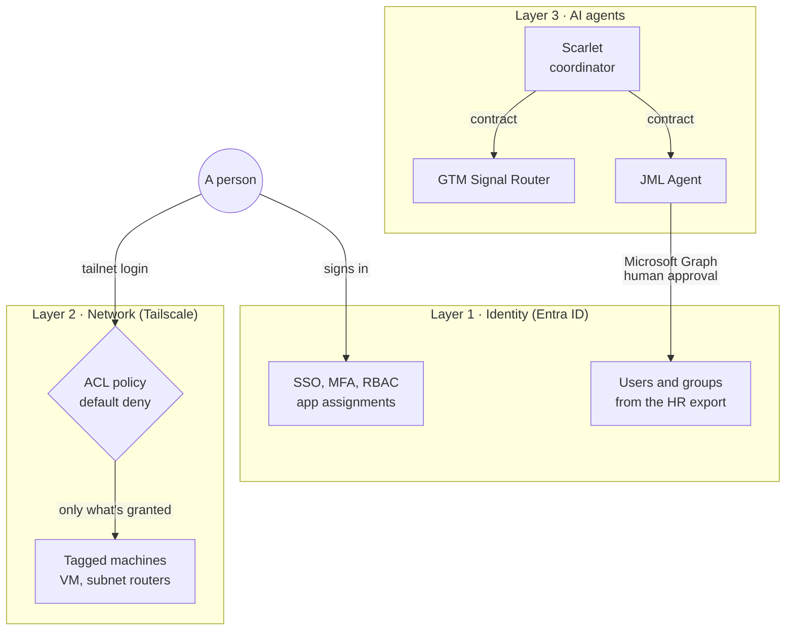
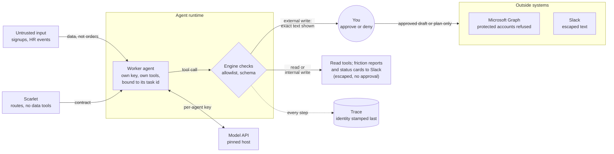
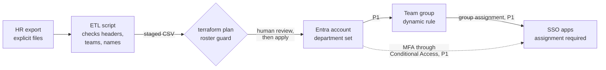

# WSHC ZTAI Lab

**Zero Trust Architecture for Identity, Network and AI Agents**

**Document Type:** Repository Overview  
**Author:** Will Chang, Zero Trust AI Engineer  
**Last Updated:** October 2026  
**Repository:** https://github.com/willshchang/WSHC-ZTAI-Lab  

---

## The Scenario

TinyCo is a fictional 90-person company with 9 teams, moving from a
traditional office network to a remote-first way of working.

This lab takes TinyCo from a raw HR export to a full Zero Trust
architecture, built entirely as code:

```
HR CSV export
  → ETL pipeline (sanitise and stage the data)
    → Terraform
      → Entra ID: users, groups, roles, MFA, SSO, SCIM      (Layer 1: Identity, Accessibility)
        → Tailscale: ACL policy, tags, SSH, subnet routing  (Layer 2: Network, Reachability)
          → AI agents: scoped identity, least privilege,    (Layer 3: Agents)
            human approval and a trace on every action
```

Every user, group, role, app assignment and network rule comes from
code. Nothing is clicked into existence by hand.

---

## Deployment Status

| Layer | Status |
|---|---|
| **Layer 1: Identity (Accessibility)** | Fully deployed and validated during the Microsoft 365 E5 trial (late spring 2026). The tenant is still live on Entra ID Free, which runs users, static groups, app registrations and the JML agent. Dynamic groups, Conditional Access and PIM need a paid tier (P1/P2), so those stay in code and docs until a license is back. |
| **Layer 2: Network (Reachability)** | Live. Tailnet, Azure VM and both subnet routers are running and managed by Terraform. |
| **Layer 3: AI agents** | Live. Scarlet (coordinator), the GTM Signal Router and the JML agent, each with its own key and tools. JML has run joiners, movers and leavers on the real tenant. CI runs 240+ checks on every push that touches the agents, and each tested safety control was broken on purpose in a local mutation sweep to prove a test catches it. |

> **Note:** Layer 1 was originally deployed to the tenant
> `TinyCoDDG.onmicrosoft.com`. The docs use `<tenant>.onmicrosoft.com`
> as a placeholder so the code stays portable to any tenant.
> Hostnames, IPs, device names and identities across the repo are
> placeholders too (`<tailnet>.ts.net`, `100.x.y.z`, `admin@example.com`).
> Real values live only in gitignored `terraform.tfvars` files.

---

## Zero Trust Architecture

Zero Trust means nothing is trusted just because it is "inside" the
network. Every request has to prove who is asking and whether they are
allowed, every time.

This lab enforces that with two independent layers. A user has to pass
**both** before reaching anything. A third layer applies the same rules to
AI agents. Each layer is named by the property it
controls:

- **Accessibility:** who can access what (identity, roles, apps)
- **Reachability:** what can reach what (machines, networks, ports)

| Layer | Question it answers | Tool |
|---|---|---|
| **1. Identity: Accessibility** | Who are you, and what are you allowed to access? | Microsoft Entra ID |
| **2. Network: Reachability** | Which machines can you actually reach, and how? | Tailscale |
| **3. AI agents** | What is each agent, and what may it touch? | TypeScript agents on Claude |
| **Cross-cutting: IaC and Automation** | How is all of this built, changed and checked? | Terraform, Bash, GitHub Actions |



A person signs in to the apps through identity, and to the tailnet, where the
network policy decides which machines they can reach. The agents act on the identity layer only through Microsoft Graph
with five least-privilege permissions and a human approval. Terraform and
GitHub Actions build and check every layer as code: Terraform owns the
structure (groups, apps, ACL), the JML agent owns people. Network detail is in
[02-network](./02-network/README.md); agent detail is in
[03-agents](./03-agents/README.md).

### Layer 1: Identity, Accessibility (Entra ID)

| Capability | What it does in plain English |
|---|---|
| **CSV-driven provisioning** | 90 users created from an HR export. No names or company data in the code. |
| **ABAC dynamic groups** | Group membership follows the user's `department` attribute. Change the department, the access follows automatically. |
| **RBAC** | Roles granted to groups, never directly to people. One `setproduct()` loop assigns every group to every app it needs. |
| **Conditional Access** | MFA required for everyone. Legacy authentication (the old protocols that can't do MFA) is blocked. Needs Entra ID P1: the policies are in code, and frozen on today's Free tenant. |
| **SSO** | Single sign-on to Tailscale (OIDC), Mattermost, Tableau and Elastic (SAML). |
| **SCIM** | Tableau accounts are created and removed automatically from Entra. |
| **Privileged Access (foundations)** | Admin roles only through dedicated role-assignable groups. Break-glass account with its own credential, a direct permanent Global Administrator role, a group-based Conditional Access exclusion and protection from deletion. |
| **App assignment required** | SSO apps issue a token only to users or groups assigned to them, never to anyone who happens to be in the tenant. |

### Layer 2: Network, Reachability (Tailscale)

| Capability | What it does in plain English |
|---|---|
| **ACL Policy as Code** | The network rulebook lives in `acl.tf`: grants, tag ownership and built-in tests. Anything not explicitly allowed is blocked. |
| **Device tags** | Machines are identified by their job (`tag:server`, `tag:subnet-router`), not by who set them up. |
| **Tailscale SSH** | Log in to servers with your identity. No SSH keys to manage, and port 22 is closed to the internet. `root` needs a browser re-authentication within the last 12 hours (`check` mode). |
| **ACL tests** | Allow and deny tests run on every `terraform plan`, including proof that the internet-facing VM can't reach the home network. |
| **Subnet routing** | Reach devices that can't run Tailscale (printers, modems, legacy servers) through a router device. |
| **High availability** | Two subnet routers advertise the same network. If one goes down, traffic moves to the other with no dropped packets. |
| **Exit nodes** | Route internet traffic through a trusted device on the tailnet. |
| **Automated enrollment** | Terraform generates short-lived, single-use auth keys so servers can join without a human logging in. |

### Cross-cutting: IaC and Automation

| Capability | What it does in plain English |
|---|---|
| **Terraform, both layers** | Identity and network are managed by the same tool and the same review process. |
| **Dropzone ETL pipeline** | The script takes the HR files by name, checks headers, teams and names, then stages a clean CSV. A roster guard stops the plan if the file has fewer rows than a set minimum (`min_expected_employees`), so a truncated export can't quietly delete users. |
| **Zero hardcode** | All real values live in gitignored `terraform.tfvars` and CSV files. Swap them and the same code deploys to another company. |
| **CI validation** | GitHub Actions runs `terraform fmt` and `validate` on both layers and the full agent test suite on every push that touches that layer, with read-only permissions and actions pinned to commit SHAs. |

---

## Security Model

How an agent's action is checked before it touches anything real. Customer
and HR data are treated as data, never as instructions. Every tool call goes
through the engine's checks, every external write waits for a human who sees
exactly what will be sent, and every step is traced with the agent's identity.



Each control, the threat it answers (mapped to the OWASP Top 10 for LLM and
Agentic Applications), its status and the test that proves it are in the
[threat model](./docs/THREAT_MODEL.md). Known gaps are listed there too.

---

## Identity Journey

How a new hire goes from an HR record to working access:



1. HR adds the person to the export with their team
2. The ETL script checks the file and stages it
3. `terraform plan` is reviewed (the roster guard stops a file below the minimum headcount), then `apply` creates the Entra ID account with the `department` attribute set
4. The dynamic group for that department picks the user up automatically (P1)
5. The group's app assignments give them SSO access to their team's apps, with MFA from Conditional Access (P1)
6. On the tailnet, the ACL policy decides which machines they can reach

Steps 4 and 5 need Entra ID P1. On today's Free tenant, app access needs
direct user assignment. See [Licensing](./01-identity/README.md#licensing-what-needs-entra-id-p1).

---

## Zero Trust Principles in This Lab

Mapped to the tenets in NIST SP 800-207:

| Principle | How this lab implements it |
|---|---|
| Every access request is authenticated and authorised | Entra ID SSO with MFA for apps, Tailscale identity and the ACL on every network connection, a policy check on every agent tool call, and human approval on every external write |
| Least privilege | Role and app access by group, network access by explicit grant, implicit deny for everything else |
| Access is decided per request, from identity and policy | Tailscale evaluates the ACL policy for each connection, not once at login |
| Network location grants nothing | No "inside" network. Port 22 closed. Being on the tailnet alone gives no access. |
| Policy is centrally managed and auditable | All policy in Terraform, version-controlled, reviewed and validated in CI |

---

## Repository Structure

```
WSHC-ZTAI-Lab/
│
├── README.md                ← you are here
├── SECURITY.md              ← how to report a vulnerability
├── docs/
│   └── THREAT_MODEL.md      ← threats, controls, status and proof
│
├── 01-identity/             ← Layer 1: Identity, Accessibility (Entra ID)
│   ├── README.md
│   ├── terraform/           ← users, groups, RBAC, Conditional Access, SSO apps
│   ├── scripts/             ← ETL pipeline, gallery app lookup
│   └── docs/                ← architecture, admin and end-user guides
│
├── 02-network/              ← Layer 2: Network, Reachability (Tailscale)
│   ├── README.md
│   ├── terraform/           ← ACL, tags, DNS, settings, subnet routes, auth keys
│   └── docs/                ← subnet routing, ACL, network architecture, Tailscale SSH
│       └── iac/             ← one doc per Terraform file
│
├── 03-agents/               ← Layer 3: Zero Trust AI agents (in progress)
│   ├── core/                ← shared agent engine: policy, approval, trace
│   ├── gtm-signal-router/   ← first agent: routes signups, human-approved
│   ├── scarlet/             ← coordinator: routes requests to agents, holds no data tools
│   ├── jml/                 ← joiner/mover/leaver on Entra ID, human-approved
│   └── examples/            ← sample traces and how to investigate with them
│
└── .github/workflows/       ← CI: Terraform validation + agent checks
```

---

## Key Design Decisions

### Zero hardcode
No user names, device IDs or credentials exist in any `.tf` file.
Real values are injected from gitignored files at deploy time. This
keeps personal data out of the repo and makes the code reusable.

### Attributes drive access, not tickets
ABAC dynamic groups mean a department change in HR moves the user's
access automatically. No one has to remember to update a group.

### Twin group architecture
Microsoft only allows directory roles on static, role-assignable
groups. So each team has a dynamic group for app access and a separate
static group for admin roles. Privileged access stays deliberate and
never changes just because an attribute changed.

### Gallery-first app registration
SaaS apps are registered from the Microsoft Entra app gallery wherever
possible, because gallery templates come with the correct SSO setup.
Custom registrations are only used when no gallery app exists.

### Import blocks for provider defaults
Tailscale creates a default ACL and DNS settings on every new tailnet.
Import blocks let Terraform adopt and take over those defaults instead
of failing, so the code is safe to run against a brand new tailnet.

### Tag ownership chain for automation
Terraform's OAuth client is given `tag:terraform`, and `tag:terraform`
owns the infrastructure tags. This lets Terraform enroll servers
automatically without a human, while humans still control who owns
`tag:terraform` in the first place.

### Secret sprawl prevention
Credentials only exist in gitignored files. Auth keys are marked
sensitive, single-use and expire after one hour. In production these
would come from a secrets manager such as Azure Key Vault or
HashiCorp Vault.

---

## IaC Boundary

Terraform manages configuration through each vendor's API. Some steps
happen on the device itself and stay manual, which is normal for any
real deployment.

| Terraform manages | Manual step |
|---|---|
| Entra ID users, groups, roles, CA policies, app registrations | Creating the tenant and the Terraform service principal |
| Tailscale ACL policy, tags, DNS, HTTPS certs | Installing Tailscale on each device |
| Subnet route approvals | Turning on subnet routing on the Apple TVs |
| Auth key generation | Running `tailscale up --auth-key=file:<path>` on the server |
| Tailscale SSH access rules | Turning on Tailscale SSH per machine (`sudo tailscale set --ssh`) |

---

## Quick Start

Each layer has its own full setup guide:

| Layer | Start here |
|---|---|
| Layer 1: Identity, Accessibility | [01-identity/README.md](./01-identity/README.md) |
| Layer 2: Network, Reachability | [02-network/README.md](./02-network/README.md) |

Both layers deploy the same way once their prerequisites and
`terraform.tfvars` are in place:

```bash
cd 02-network/terraform           # or 01-identity/terraform
terraform init
terraform plan                    # review before changing anything
terraform apply
```

---

## Documentation Guide

| Goal | Document |
|---|---|
| Identity architecture and design decisions | [ARCHITECTURE.md](./01-identity/docs/ARCHITECTURE.md) |
| Recreate the identity layer from scratch | [01-setup-guide.md](./01-identity/docs/admin/01-setup-guide.md) |
| Roles, Conditional Access and break-glass | [02-security-model.md](./01-identity/docs/admin/02-security-model.md) |
| User and group lifecycle | [03-provisioning.md](./01-identity/docs/admin/03-provisioning.md) |
| End-user onboarding | [01-getting-started.md](./01-identity/docs/user/01-getting-started.md) |
| Network architecture | [03-Network_Architecture.md](./02-network/docs/03-Network_Architecture.md) |
| ACL policy and tags | [02-ACL_Tags_and_Access_Control.md](./02-network/docs/02-ACL_Tags_and_Access_Control.md) |
| Subnet routing and HA | [01-Subnet_Router_Setup_and_Troubleshooting.md](./02-network/docs/01-Subnet_Router_Setup_and_Troubleshooting.md) |
| Tailscale SSH | [04-Tailscale_SSH_Setup_and_Troubleshooting.md](./02-network/docs/04-Tailscale_SSH_Setup_and_Troubleshooting.md) |
| Network Terraform, file by file | [02-network/docs/iac/](./02-network/docs/iac/) |
| AI agents: design, controls and how to run them | [03-agents/README.md](./03-agents/README.md) |
| Investigating an agent incident from its traces | [sample-traces/README.md](./03-agents/examples/sample-traces/README.md) |
| Threats, controls, status and proof | [THREAT_MODEL.md](./docs/THREAT_MODEL.md) |

---

## Roadmap

| Item | Why it matters |
|---|---|
| **PIM just-in-time roles** | Admins request elevation for a set time with approval, instead of holding permanent admin rights |
| **Terraform remote state** | Shared, locked, encrypted state instead of a local state file (state holds passwords and keys) |
| **Tailnet on Entra ID** | Tailnet sign-in through Entra ID, with SCIM groups in the ACL, so one identity provider and one MFA policy gate both layers |
| **Automated access reviews** | Scheduled review of who still needs what |
| **`03-agents/`** (in progress) | Extend the same identity and network controls to AI agents: scoped identities per agent, least-privilege tool access, human approval, traces. Built: [GTM Signal Router](./03-agents/README.md), the Scarlet coordinator and the JML agent (Entra ID, least-privilege Graph permissions), each with its own API key. Next: split JML per event type, secretless identity, network-level containment |
| **Agent observability** | Follow every agent run end to end and live: what triggered it, what it decided, which identity it used, what it touched and the outcome. One OpenTelemetry trace per run, identity on every span, secrets redacted before storage. Today the lab has visibility only (Tailscale configuration audit logs); network flow logs require a Tailscale Premium or Enterprise plan. |

---

## Tech Stack

| Area | Technology |
|---|---|
| Identity | Microsoft Entra ID (built for P1/P2, validated on an M365 E5 trial, now on Free) |
| Network | Tailscale |
| IaC | Terraform (`azuread`, `azurerm`, `tailscale` providers) |
| Compute | Azure VM, Ubuntu 24.04, Canada Central |
| SaaS (SSO) | Mattermost, Tableau Cloud, Elastic Cloud |
| Agents | TypeScript, Node.js, Claude (one API key per agent) |
| Automation | Bash, GitHub Actions |

---

## Security Notes

- No credentials, personal data or real employee data in this repository
- HR CSV files, `terraform.tfvars`, certificates and keys are gitignored
- SSH port 22 is closed to the public internet; server access is through Tailscale SSH only
- Network policy is default deny; only explicit grants allow traffic
- Threats, controls and known gaps: [THREAT_MODEL.md](./docs/THREAT_MODEL.md). To report a vulnerability: [SECURITY.md](./SECURITY.md)

---

## Official References

| Topic | URL |
|---|---|
| NIST SP 800-207 Zero Trust Architecture | https://csrc.nist.gov/pubs/sp/800/207/final |
| OWASP Top 10 for LLM Applications (2025) | https://genai.owasp.org/initiatives/top-10-for-llm-and-genai/ |
| OWASP Top 10 for Agentic Applications | https://genai.owasp.org/2025/12/09/owasp-top-10-for-agentic-applications-the-benchmark-for-agentic-security-in-the-age-of-autonomous-ai/ |
| Microsoft Entra ID documentation | https://learn.microsoft.com/en-us/entra/identity/ |
| Entra dynamic groups | https://learn.microsoft.com/en-us/entra/identity/users/groups-dynamic-membership |
| Conditional Access | https://learn.microsoft.com/en-us/entra/identity/conditional-access/overview |
| Terraform `azuread` provider | https://registry.terraform.io/providers/hashicorp/azuread/latest/docs |
| Tailscale Terraform provider | https://registry.terraform.io/providers/tailscale/tailscale/latest/docs |
| Tailscale ACL policy syntax | https://tailscale.com/docs/reference/syntax/policy-file |
| Tailscale SSH | https://tailscale.com/docs/features/tailscale-ssh |
| Tailscale configuration audit logs | https://tailscale.com/docs/features/logging/audit-logging |
| Tailscale network flow logs | https://tailscale.com/kb/1219/network-flow-logs |
| OpenTelemetry GenAI semantic conventions | https://opentelemetry.io/docs/specs/semconv/registry/attributes/gen-ai/ |
